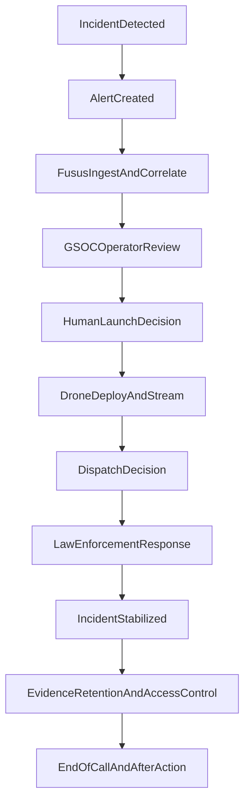

# Incident-to-End-of-Call ConOps

## Purpose
Define the operational flow for Thor-supported school emergency response from first signal through closure, including human, technical, and legal/policy hand-offs.

## Scope
This ConOps describes a critical-incident workflow integrating school alerts, Fusus, GSOC operations, drone deployment support, and law enforcement dispatch coordination.

## Actor Definitions
- School Staff: initiates emergency protocols and confirms initial context.
- School Safety Lead: validates escalation and coordinates with district process.
- Fusus Platform: ingests and correlates alert and camera data.
- GSOC Operator: performs human review and launch/escalation decisions.
- Drone Operations Function: executes approved launch and streaming procedures.
- Dispatch (Public Safety): receives verified situational data and coordinates response.
- Law Enforcement/First Responders: conduct on-scene intervention.
- District Compliance/Data Steward: oversees post-incident data handling and retention policy compliance.

## End-to-End Flow

### Phase 1: Detection and Initial Alert
1. Incident occurs or a verified threat indicator is observed.
2. School staff activates emergency alert protocol.
3. Alert enters Fusus via approved integration path.

Hand-offs
- Human: School Staff -> School Safety Lead.
- Technical: Alert signal -> Fusus ingestion pipeline.
- Legal/Policy: Activation must match approved incident categories.

### Phase 2: Correlation and Human Review
4. Fusus correlates alert metadata and available camera context.
5. GSOC operator receives incident queue entry.
6. GSOC performs human review for signal validity and urgency.

Hand-offs
- Human: School Safety Lead -> GSOC Operator.
- Technical: Fusus correlated incident package -> GSOC console.
- Legal/Policy: Access to data limited to authorized incident roles.

### Phase 3: Launch Decision and Aerial Visibility
7. GSOC confirms policy-qualified criteria and makes launch decision.
8. Drone operation is initiated under approved SOP.
9. Live stream and telemetry are shared with authorized responders.

Hand-offs
- Human: GSOC Operator -> Drone Operations Function.
- Technical: Launch command -> Drone system + live feed routing.
- Legal/Policy: Launch authority and rationale logged for audit.

### Phase 4: Dispatch and Active Response
10. GSOC/public safety liaison communicates verified situational context to dispatch.
11. Dispatch determines response level and units.
12. Responders receive updates as incident evolves.

Hand-offs
- Human: GSOC/liaison -> Dispatch -> Field responders.
- Technical: Live incident context -> dispatch information systems.
- Legal/Policy: Information sharing follows jurisdiction and policy restrictions.

### Phase 5: Stabilization and End-of-Call
13. Incident reaches stabilized state.
14. Drone operations stand down per protocol.
15. End-of-call criteria confirmed and incident status formally closed.

Hand-offs
- Human: Incident command -> GSOC -> District safety lead.
- Technical: Live stream termination + incident record finalization.
- Legal/Policy: Closure markers and timeline retained per governance requirements.

### Phase 6: Post-Incident Governance
16. Evidence/data handling transitions to retention and access governance workflow.
17. After-action review conducted across school/public safety stakeholders.
18. Policy or training updates captured for continuous improvement.

Hand-offs
- Human: Operations teams -> compliance/policy owners.
- Technical: Incident package -> controlled storage/audit systems.
- Legal/Policy: Retention period, disclosure, and deletion obligations executed.

## Responsibility Matrix (RACI-Style Snapshot)
| Workflow Step | Primary Responsible | Supporting Roles | Approval/Authority |
| --- | --- | --- | --- |
| Initial emergency trigger | School Staff | School Safety Lead | School emergency policy |
| Incident correlation | Fusus Platform (system) | GSOC Operator | Authorized access policy |
| Launch decision | GSOC Operator | Safety lead liaison | Launch SOP and incident criteria |
| Dispatch escalation | Dispatch | GSOC liaison | Jurisdiction protocol |
| End-of-call closure | Incident command/GSOC | District safety lead | Closure checklist |
| Retention and audit | Compliance/Data Steward | Legal/IT | Data governance policy |

## Policy Checkpoints
- Confirm incident qualifies under activation policy before launch.
- Validate authorized-role access at each data touchpoint.
- Record launch, escalation, dispatch, and stand-down decisions with timestamps.
- Apply retention/deletion schedule after closure.
- Document exception handling for legal holds and investigations.

## Failure and Fallback Modes
- If drone unavailable: continue response using fixed camera and staff reports.
- If feed degraded: GSOC flags confidence level and uses alternate data sources.
- If integration latency occurs: manual dispatch escalation path is preserved.
- If policy ambiguity exists: default to human supervisory review before escalation.

## Metrics for Operational Readiness
- Alert-to-review time.
- Review-to-launch decision time.
- Launch-to-live-visibility time.
- Dispatch coordination hand-off completion rate.
- Policy-compliant audit log completion rate.

## ConOps Flow Diagram

