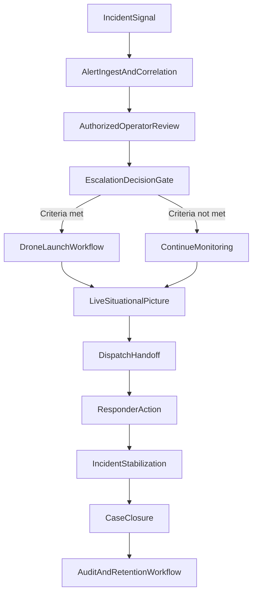

# Week 01 Draft: Rough End-to-End Operational Flow (Alert to Dispatch)

## Purpose
Provide a rough baseline operational sequence from initial school incident signal through dispatch and closure, with human, technical, and policy hand-offs called out for refinement.

## Rough Flow Summary
1. Incident signal is triggered (manual or system-driven).
2. Alert enters correlation platform and is enriched with available context.
3. Authorized operator performs rapid validation.
4. Escalation decision is made under policy criteria.
5. Drone support may be launched by authorized personnel.
6. Live situational picture is shared with responders.
7. Dispatch receives validated context and assigns response.
8. Incident stabilizes; response shifts to closure and governance workflow.

## Draft ConOps Diagram (Rough)

## Hand-Off Table (Draft)
| Stage | Human Owner | Technical Action | Policy/Legal Check |
| --- | --- | --- | --- |
| Signal trigger | School staff/systems | Alert created | Trigger category valid |
| Correlation | Platform + operator | Data fusion/map update | Access role valid |
| Review | GSOC/command operator | Context verification | Human review required |
| Escalation | Authorized decision-maker | Launch/escalation command | SOP criteria met |
| Dispatch | Liaison/dispatcher | Incident package transfer | Sharing rules followed |
| Closure | Incident command + district safety lead | Stream stop/case close | Retention and audit policy |

## Major Assumptions
- Human-in-the-loop decisions remain mandatory at escalation points.
- Alert quality and camera availability vary by site.
- Dispatch interoperability may differ by jurisdiction.
- Legal constraints on school video sharing are jurisdiction-specific.

## Immediate Refinement Tasks (Next)
1. Define specific activation triggers and exclusions by policy category.
2. Add fallback paths for integration outage and degraded feed confidence.
3. Assign named RACI roles for each school district archetype.
4. Attach target timing metrics per stage (e.g., alert-to-review threshold).
5. Validate each stage against local legal/privacy requirements.
